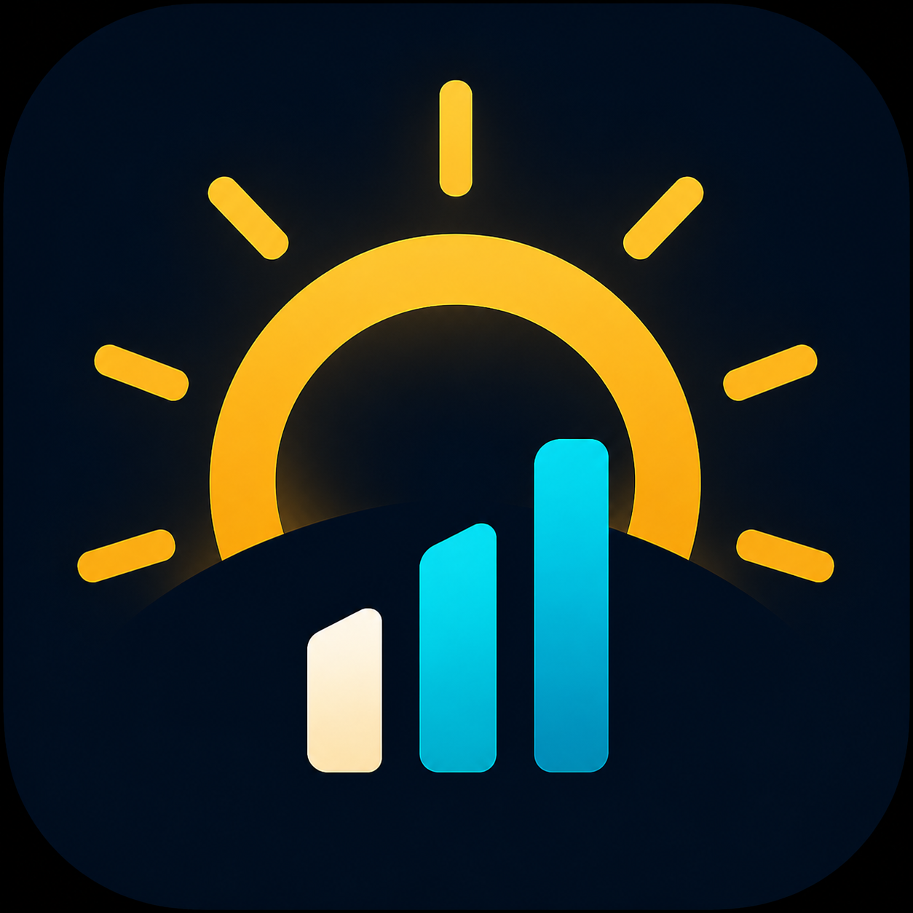

# Legacy Solar Monitor

Free Android app for **old Bluetooth solar inverters**: live power, archive sync, SBFspot-style imports, reports, widgets, and optional Google Drive backup.

This is an independent hobby project. It is **not affiliated with, endorsed by, or an official product of SMA Solar Technology AG**. SMA, Sunny Boy, Sunny Portal, and related names are trademarks of their owners and are used only to describe compatible hardware.

## Author

- Andre Lorbach
- alorbach@adiscon.com
- Source: [https://github.com/alorbach/legacy-solar-monitor](https://github.com/alorbach/legacy-solar-monitor)
- Privacy: [docs/PRIVACY.md](docs/PRIVACY.md)

License: [Apache License 2.0](LICENSE)

## Features

- Live Bluetooth reads and a foreground live monitor (poll interval 15–3600 s)
- Day/month archive sync from the inverter (merge, does not wipe other history)
- SBFspot CSV, ZIP, and SQLite import from a file, URL, FTP, or SFTP
- Stats by hour/day/month/year, CSV/PDF reports, feed-in tariffs and earnings
- Home-screen widgets and optional Google Drive backup/restore

## What it talks to today

Classic Bluetooth SMA Sunny Boy–class inverters (SBFspot-compatible protocol). There is no vendor picker; every added device uses that stack. Same-generation units can usually be added in the UI with no code change — see [docs/DEV-add-device.md](docs/DEV-add-device.md).

Package name (do not change): `com.alorbach.solarmonitor`

`_legacy/sbfspot.3` is upstream SBFspot C++ reference material. It is not part of the Android build.

## Requirements

- Android 9+ (`minSdk` 28)
- A classic-Bluetooth SMA Sunny Boy–class inverter
- Nearby devices + **precise location**, with Location (GPS) on, to discover unpaired boxes
- Google Play services only if you use Drive backup

## Docs

- [User guide](docs/USER-GUIDE.md) — permissions, devices, live, import, widgets, backup
- [Privacy policy](docs/PRIVACY.md) — Play Store URL; EN + DE
- [Play listing copy](docs/PLAY-LISTING.md) — store text, screenshots, publisher checklist
- [Play Data Safety](docs/PLAY-DATA-SAFETY.md) — Console form answers from the code
- [Architecture](docs/ARCHITECTURE.md) — layers, Room, Bluetooth, import, Drive, tests
- [Add another old device](docs/DEV-add-device.md) — UI-only vs protocol tweak vs new vendor
- [Google Drive backup setup](docs/DEV-google-drive.md) — publisher OAuth; users only sign in

## Build

Android Studio / Gradle **9.7**, JDK **21**. `minSdk` 28, `compileSdk`/`targetSdk` 35. Kotlin bytecode is Java 17.

Optional Drive sign-in: set `google.web.client.id` in `local.properties` as described in the Drive doc. The file is not in Git.
