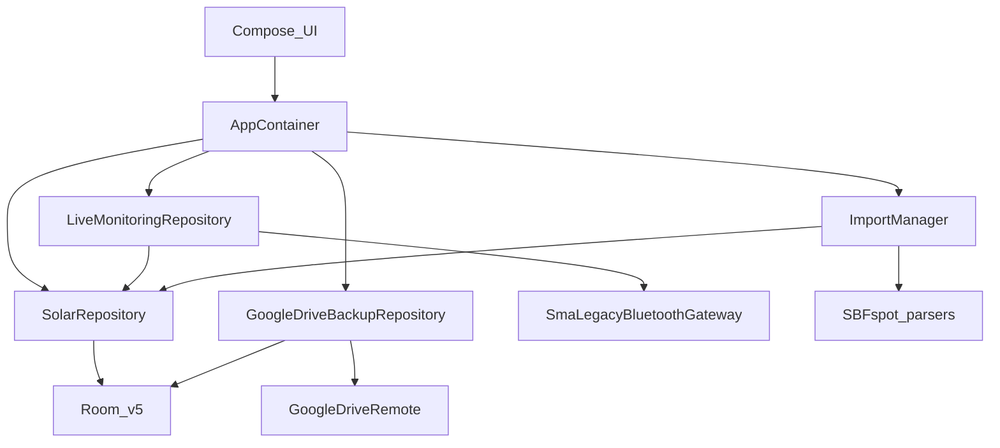

# Architecture

Developer map of Legacy Solar Monitor. User-facing steps are in [USER-GUIDE.md](USER-GUIDE.md). Privacy policy: [PRIVACY.md](PRIVACY.md). Adding another inverter is [DEV-add-device.md](DEV-add-device.md). Publisher Drive OAuth is [DEV-google-drive.md](DEV-google-drive.md). Signed GitHub APK/AAB: [DEV-github-release.md](DEV-github-release.md).

## Layout

Single Gradle module `:app` (`settings.gradle.kts` → `rootProject.name` `legacy-solar-monitor`).

| Area | Path |
|---|---|
| UI | `app/src/main/java/.../ui/`, `MainActivity.kt` |
| Data | `data/` — Room, repositories, import, cloud, settings |
| Bluetooth | `device/SmaLegacyBluetoothGateway.kt` |
| Domain | `domain/` — stats, earnings, events, reports |
| Background | `service/`, `work/` |
| Widgets | `widget/SolarWidgets.kt` |
| i18n | `i18n/LocaleController.kt`, `values/` + `values-de/` |
| Unit tests | `app/src/test/` |
| Instrumented | `app/src/androidTest/` |
| Room schemas | `app/schemas/com.alorbach.solarmonitor.data.local.SolarMonitorDatabase/` |
| SBFspot C++ reference | `_legacy/sbfspot.3/` — **not** an Android dependency |

Package / `applicationId`: `com.alorbach.solarmonitor` — **do not change** (Play listing and OAuth SHA-1 clients).

## Layers

```text
Compose UI (MainActivity + ui/*)
        ↓
AppContainer (manual DI)
        ↓
SolarRepository | LiveMonitoringRepository | ImportManager | Drive
        ↓
Room solar-monitor.db v5 | SmaLegacyBluetoothGateway | parsers/remote | GoogleDriveRemote
```



Jetpack Compose Material3, light/dark from the system. Tabs: `DashboardTab`, `StatisticsScreen`, `DevicesTab`, `ImportTab`, `SettingsTab`.

## Dependency injection

[AppContainer.kt](../app/src/main/java/com/alorbach/solarmonitor/data/AppContainer.kt) is plain constructor wiring (no Hilt/Koin). Created in [SolarMonitorApplication.kt](../app/src/main/java/com/alorbach/solarmonitor/SolarMonitorApplication.kt) `onCreate`. `container.close()` releases the Bluetooth gateway.

Owns: `CredentialStore`, `AppSettingsStore`, `SolarMonitorDatabase`, `SmaLegacyBluetoothGatewayImpl`, `ReportExporter`, `GoogleDriveAuth`, `GoogleDriveBackupRepository`, `CloudBackupCoordinator`, `EventAlertNotifier`, `SolarRepository`, `LegacySbfspotImporters`, `ImportManager`, `LiveMonitoringRepository`.

## Room

[SolarMonitorDatabase.kt](../app/src/main/java/com/alorbach/solarmonitor/data/local/SolarMonitorDatabase.kt) — file `solar-monitor.db`, **version 5**, `exportSchema = true`.

Entities in [Models.kt](../app/src/main/java/com/alorbach/solarmonitor/data/model/Models.kt):

| Entity | Role |
|---|---|
| `DeviceProfileEntity` | Name, MAC (unique), PIN ref, timezone, CSV locale, last diagnostics |
| `ImportSourceEntity` | Remembered import URI per device |
| `TariffPeriodEntity` | Feed-in price windows |
| `SpotSampleEntity` | Live spot samples |
| `DayAggregateEntity` / `MonthAggregateEntity` / `HourAggregateEntity` | Yield aggregates |
| `DeviceEventEntity` | Inverter events |
| `ImportJobEntity` | Import attempts + replay config |

Migrations:

- **3 → 4** — `hour_aggregates`; unique uppercase `btMac`
- **4 → 5** — `import_jobs.replayConfigJson`, `passwordCredentialId`
- Versions **1–2** — `fallbackToDestructiveMigrationFrom`; downgrade is also destructive
- From v3 onward, ship a real `Migration`

PINs and FTP/SFTP passwords live in [CredentialStore.kt](../app/src/main/java/com/alorbach/solarmonitor/data/security/CredentialStore.kt), not in Room plaintext. Settings use DataStore (`AppSettingsStore`).

`DeviceTransport.BLUETOOTH_LEGACY` is the only live transport. `SPEEDWIRE_FUTURE` is a stub.

## Bluetooth and live monitor

Gateway implementation and Path A/B/C: [DEV-add-device.md](DEV-add-device.md).

[LiveMonitoringRepository.kt](../app/src/main/java/com/alorbach/solarmonitor/data/repository/LiveMonitoringRepository.kt) runs test, one-shot live, and day/month archive sync (default last 30 days / 12 months; no event download), then writes through `SolarRepository`. Archive sync can enqueue auto Drive backup.

[LiveMonitorService.kt](../app/src/main/java/com/alorbach/solarmonitor/service/LiveMonitorService.kt) is a `connectedDevice` foreground service. It polls each persisted device ID at `livePollIntervalSeconds`. [BootLiveMonitorReceiver.kt](../app/src/main/java/com/alorbach/solarmonitor/service/BootLiveMonitorReceiver.kt) restarts after `BOOT_COMPLETED` / HTC quickboot (~8 s delay) and after `MY_PACKAGE_REPLACED` (no delay) if IDs are still persisted. **Stop** clears those IDs.

## Import pipeline

| Piece | File |
|---|---|
| Orchestrator | [ImportManager.kt](../app/src/main/java/com/alorbach/solarmonitor/data/importing/ImportManager.kt) |
| Parsers | [LegacySbfspotImporters.kt](../app/src/main/java/com/alorbach/solarmonitor/data/importing/LegacySbfspotImporters.kt) → `SbfspotCsvParser`, `LegacySqliteImporter`, ZIP flatten |
| Remote | [RemoteImportClients.kt](../app/src/main/java/com/alorbach/solarmonitor/data/importing/RemoteImportClients.kt) — OkHttp URL, commons-net FTP, JSch SFTP |
| UI wizard | [RemoteImportWizard.kt](../app/src/main/java/com/alorbach/solarmonitor/ui/RemoteImportWizard.kt) |
| Foreground | [ImportForegroundService.kt](../app/src/main/java/com/alorbach/solarmonitor/service/ImportForegroundService.kt) (`dataSync`) |
| Schedule | [ScheduledImportWorker.kt](../app/src/main/java/com/alorbach/solarmonitor/work/ScheduledImportWorker.kt) |
| Replay | [ImportReplay.kt](../app/src/main/java/com/alorbach/solarmonitor/data/importing/ImportReplay.kt) |

Concurrency gate: one import at a time. Day yields merge via [DayAggregateMerger.kt](../app/src/main/java/com/alorbach/solarmonitor/data/local/DayAggregateMerger.kt) (Bluetooth archive / SQLite outrank month CSV, which outranks other CSV). Successful imports can enqueue auto backup. Inverter events come from import parsers, not from Bluetooth archive sync.

## Drive backup (runtime)

Publisher Cloud Console steps stay in [DEV-google-drive.md](DEV-google-drive.md).

| Piece | File |
|---|---|
| Auth | [GoogleDriveAuth.kt](../app/src/main/java/com/alorbach/solarmonitor/data/cloud/GoogleDriveAuth.kt) — Play Services Identity, `BuildConfig.GOOGLE_WEB_CLIENT_ID` |
| Upload / restore | [GoogleDriveBackupRepository.kt](../app/src/main/java/com/alorbach/solarmonitor/data/cloud/GoogleDriveBackupRepository.kt), [GoogleDriveRemote.kt](../app/src/main/java/com/alorbach/solarmonitor/data/cloud/GoogleDriveRemote.kt) |
| Schedule | [CloudBackupCoordinator.kt](../app/src/main/java/com/alorbach/solarmonitor/data/cloud/CloudBackupCoordinator.kt) → [CloudBackupWorker.kt](../app/src/main/java/com/alorbach/solarmonitor/work/CloudBackupWorker.kt) |
| Policy | [CloudBackupPolicy.kt](../app/src/main/java/com/alorbach/solarmonitor/data/cloud/CloudBackupPolicy.kt) — 15 min auto throttle, folder `Legacy Solar Monitor` (+ previous `SMA Solar Monitor`), `solar-monitor.db` |

Auto backup is enqueued after a successful archive **Sync**, a successful import, clear history, or import-job deletes — not after one-shot **Live** or live-monitor polls.

Restore replaces the local Room DB and restarts via [AppProcessRestarter.kt](../app/src/main/java/com/alorbach/solarmonitor/service/AppProcessRestarter.kt) / [RestartRelayActivity.kt](../app/src/main/java/com/alorbach/solarmonitor/service/RestartRelayActivity.kt) (second process, so the UI is not killed in place). `CredentialStore` (SMA PINs, FTP/SFTP passwords) is not in `solar-monitor.db` and is not restored. Scope is `drive.file` only.

The app implements `Configuration.Provider` and disables the default WorkManager initializer in the manifest.

## Domain

| Piece | Role |
|---|---|
| [StatisticsAggregator.kt](../app/src/main/java/com/alorbach/solarmonitor/domain/StatisticsAggregator.kt) | Hour yield from spot samples |
| [Analytics.kt](../app/src/main/java/com/alorbach/solarmonitor/domain/Analytics.kt) | Earnings, dashboard metrics, yield labels |
| [EventCatalog.kt](../app/src/main/java/com/alorbach/solarmonitor/domain/EventCatalog.kt) | Hardcoded event severity/labels |
| [EventAlertPolicy.kt](../app/src/main/java/com/alorbach/solarmonitor/domain/EventAlertPolicy.kt) / [EventAlertNotifier.kt](../app/src/main/java/com/alorbach/solarmonitor/service/EventAlertNotifier.kt) | WARNING notifications, watermarks |
| [ReportExporter.kt](../app/src/main/java/com/alorbach/solarmonitor/domain/ReportExporter.kt) | CSV/PDF share via FileProvider |
| [ProductionStepline.kt](../app/src/main/java/com/alorbach/solarmonitor/domain/ProductionStepline.kt) | Chart series shape |

Widgets: Glance receivers in the manifest; [SolarWidgets.kt](../app/src/main/java/com/alorbach/solarmonitor/widget/SolarWidgets.kt).

## Build

| Item | Value |
|---|---|
| Gradle | 9.7.0 |
| AGP | 9.3.1 |
| Kotlin | 2.2.10 |
| JDK for Gradle | **21** |
| `compileOptions` / `jvmTarget` | 17 |
| `minSdk` | 28 |
| `compileSdk` / `targetSdk` | 35 |
| Secret | `google.web.client.id` in `local.properties` or env `GOOGLE_WEB_CLIENT_ID` → `BuildConfig.GOOGLE_WEB_CLIENT_ID` |

Release builds minify and shrink resources.

## Tests

**Unit** (`app/src/test`): CSV parser, earnings, aggregator, dashboard metrics, day merger, event catalog/alerts/grouping, cloud policy, import grouping/retry, boot receiver, remote browse helpers, report format, production stepline.

**androidTest**: [MigrationAndSaveDeviceTest.kt](../app/src/androidTest/java/com/alorbach/solarmonitor/MigrationAndSaveDeviceTest.kt) — Room migrations and unique MAC save.

No Bluetooth gateway or full UI instrumentation suite.
