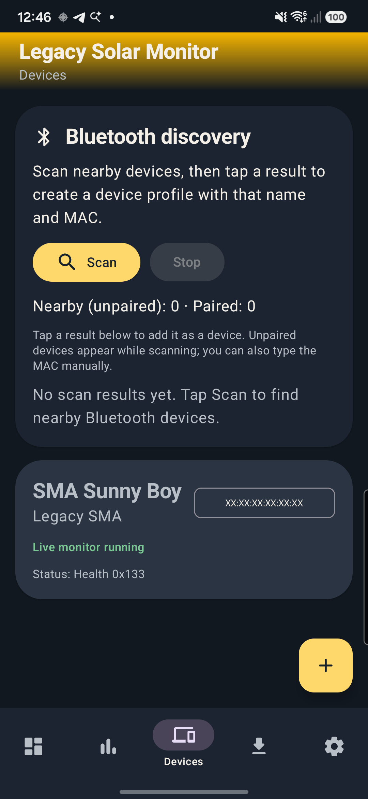
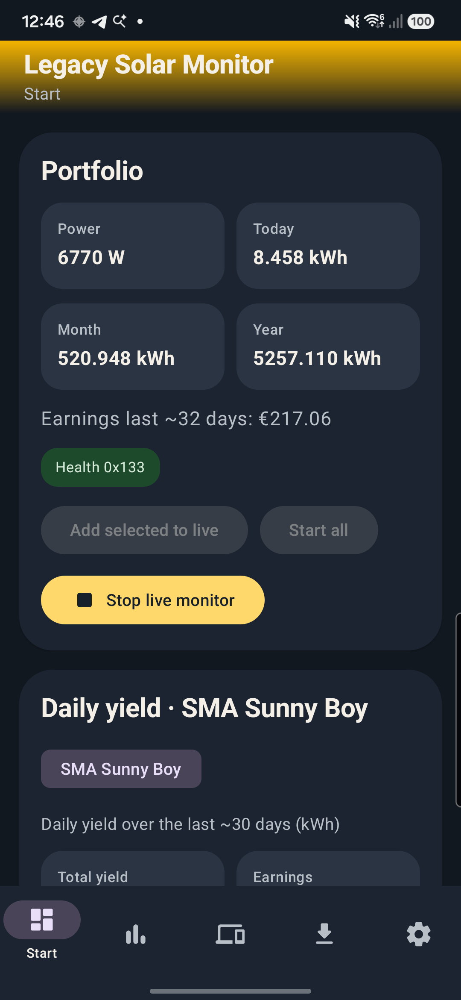
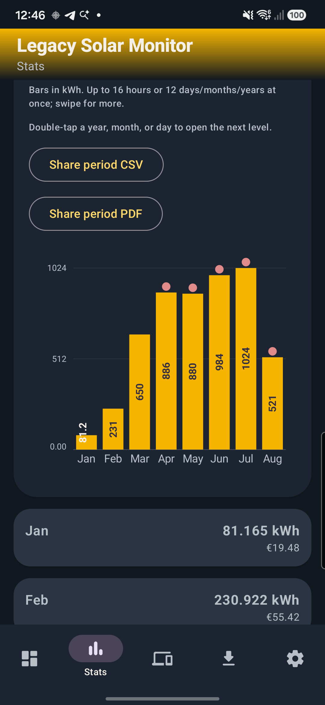
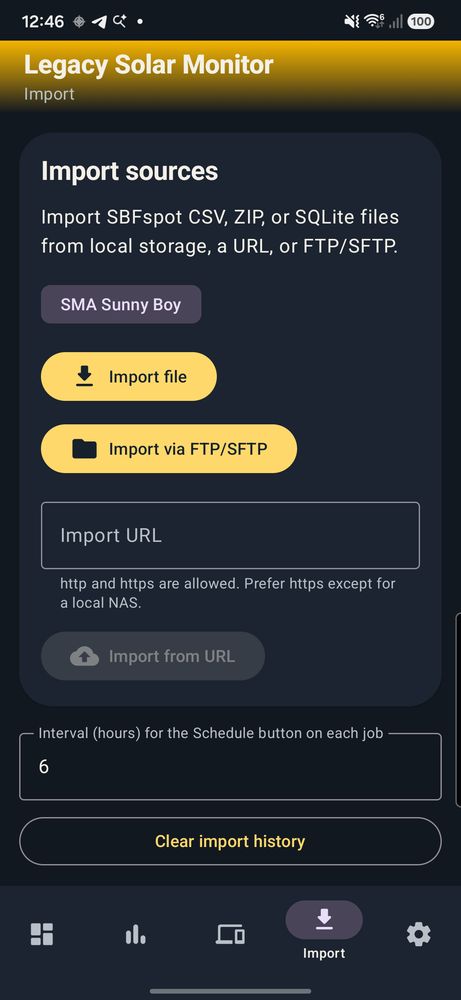
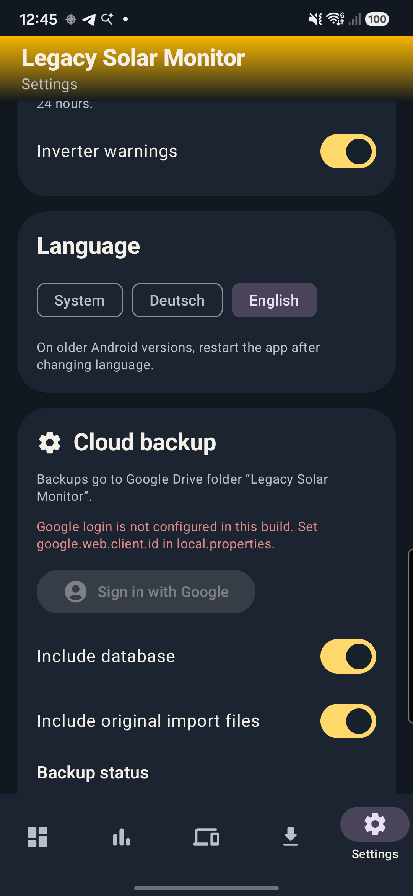

# User guide

Legacy Solar Monitor is a free Android app for **old classic-Bluetooth SMA Sunny Boy–class inverters**. Tab names below match the English UI (`Start`, `Stats`, `Devices`, `Import`, `Settings`). The in-app language can be System, Deutsch, or English.

This project is not affiliated with SMA Solar Technology AG. SMA and Sunny Boy names describe compatible hardware only.

## What you need

- An inverter that speaks the **SBFspot-compatible SMA Bluetooth** protocol. There is no vendor or protocol picker; every device uses that stack.
- Many of these boxes stay **unpaired**. That is expected. Android still needs Nearby devices, **precise location**, and Location (GPS) turned on so they appear in Scan.
- One profile per Bluetooth MAC.

Same-generation units can usually be added in the UI with no code change. See [DEV-add-device.md](DEV-add-device.md).

## Permissions

| Permission / setting | Why |
|---|---|
| Nearby devices (`BLUETOOTH_SCAN` / `BLUETOOTH_CONNECT` on Android 12+) | Scan, connect, live, and archive sync |
| Precise location | Classic discovery of **unpaired** devices |
| Location (GPS) on | Same unpaired discovery |
| Bluetooth adapter on | Any Bluetooth action |
| Notifications (Android 13+) | Live monitor, import progress, inverter warnings |
| Unrestricted battery | Scheduled imports, long FTP, and live reliability on aggressive OEMs |
| Internet | URL / FTP / SFTP import and Drive backup |
| Storage via the system file picker | Local file import (no broad storage permission) |

The yellow banner at the top of the app opens App, Location, or Bluetooth settings when something required is off.

## Add a device

1. Open **Devices**. Grant Nearby devices and precise location if asked, and turn Location on.
2. Tap **Scan**. Unpaired devices show while the scan runs; already-bonded ones are listed too. Names containing `SMA` sort first.
3. Tap a result to create a profile (Bluetooth name, MAC, model `Legacy SMA`, PIN seed `0000`). A new profile also gets a default EUR tariff.
4. Or tap **+**. That seeds from the best nearby/bonded device, or a blank profile if nothing is in range. You can type the MAC later.
5. Edit name, owner, PIN, MAC, serial, and model. PIN is digits, max 12. Login is **user-level** only (seed `0000` on many boxes). An installer PIN will not work.
6. Tap **Save**, then **Test**. When that succeeds, use **Live** (one-shot read) and **Sync** (archive).

One profile per MAC. Duplicate MACs are rejected.

### Advanced (per device)

Under **Advanced**: timezone (for example `Europe/Berlin`) and CSV decimal / delimiter / date format used when importing SBFspot files for that device.

## Live monitoring

**Live** on Devices is a **single** Bluetooth read. It is not the continuous monitor.

On **Start**:

- **Start selected** — foreground service for the device selected on the daily-yield chip (or **Add selected to live** if the monitor is already running).
- **Start all** — live for every device (union with whatever is already running).
- **Stop live monitor** — stops the service and clears the persisted device list. After Stop, boot will not restart live.

While live runs you get a persistent **Live monitor** notification. Poll interval is **Settings → Live poll interval (seconds)** (15–3600, default 60). After reboot or quickboot, live restarts automatically **only if** you had not tapped Stop (about 8 seconds delay so Bluetooth is up). After an app update it restarts immediately if those IDs are still persisted.

Allow **unrestricted battery** in Settings if the phone kills the service overnight.

Needs a saved MAC and PIN, and a working Bluetooth login.

## Archive, tariffs, events

On the expanded device card:

- **Sync** pulls about the last **30 days** of day archive and **12 months** of month archive from the inverter. It does **not** download inverter events. Bluetooth archive ranks above CSV on the same day; other stored history is kept.
- **Clear history** deletes spot samples, day/month/hour aggregates, and events for that device. The profile stays. Disabled while live monitor is running for that device. Sync afterward only refills those 30-day / 12-month windows. Older or imported data outside them is gone unless you re-import.
- **Delete** removes the profile, Room history, events, and stored PINs/import passwords. Irreversible. Original import file copies under app-private storage are **not** deleted; if Cloud backup includes original import files, those leftovers can still be uploaded. Uninstalling the app removes them.
- **Feed-in tariffs** — dated €/kWh (or other currency) periods. Earnings on Start, Stats, and widgets need at least one period. Open-ended “to” is allowed.
- **Inverter events** — last 50 events from **import** (SBFspot Events CSV or SQLite `EventData`). Filters: All / Warning / Info.

**Show diagnostics** prints the last connection log (RFCOMM strategy, errors). Useful if Test or Live fails.

## Start, Stats, and reports

**Start** shows portfolio power, today / month / year yield, and earnings from the latest 32 stored production days (not necessarily the last 32 calendar days if history has gaps). Below that: a ~30-day daily yield chart, period totals, and per-device cards (now/today, DC/AC, temperature, Hz, grid relay, Bluetooth %, serial — electrical fields appear after a live read). Share CSV/PDF for the device snapshot or the selected period.

**Stats**:

- Granularity: Hour / Day / Month / Year
- Inverter: All, or one device
- Prev / **Now** / Next (year has no next)
- Totals: yield, peak power, earnings
- Bar chart: tap a bucket; double-tap Year → Month → Day → Hour. Up to 16 hours or 12 bars at once; swipe for more
- Events in the selected window
- **Share period CSV** / **Share period PDF**

Empty charts mean you still need a Sync or an SBFspot import.

## Import SBFspot data

Add a device first, then select it as the import target.

| Source | Notes |
|---|---|
| **Import file** | CSV, ZIP, or SQLite via the system picker |
| **Import from URL** | `http` / `https`. Prefer https except on a local NAS |
| **Import via FTP/SFTP** | Wizard: protocol → device → connect → file or folder → confirm |

CSV day files have a datetime header; month files a date-only header. Event CSVs use the SBFspot `DeviceType;DeviceLocation;SusyId;SerNo…` header. ZIP archives are flattened and each entry parsed. SQLite expects tables `SpotData`, `DayData`, `MonthData`, `EventData`.

**Merge rule:** other history is kept unless the remote wizard **Delete existing device data before import** is checked. On a given day, Bluetooth archive and SQLite outrank month CSV, which outranks other CSV. A lower-ranked file does **not** overwrite a higher-ranked day. Equal rank overwrites, except a zero/negative ordinary CSV yield does not replace a stored positive value.

FTP sends username, password, and files in **cleartext**. Prefer SFTP. The first SFTP connection stores the server host key (TOFU); verify the host on a trusted network. Folder imports have CSV-count and size limits; pick a smaller subfolder if you hit them.

Only one import runs at a time (foreground **Data import** notification; you can stop it there). Job history lists attempts; removing a job does **not** delete imported solar data.

**Run import again** re-downloads the same source and merges. You may need the password or URL again.

**Schedule import** on a successful job repeats every N hours (1–168). Credentials must already be stored. Allow unrestricted battery so WorkManager is not killed.

## Home-screen widgets

| Widget | Shows |
|---|---|
| Solar Compact Stats | Power + today |
| Solar Device Summary | Power, today, month, earnings |
| Solar Top Devices | Top 3 by current power |

Compact and medium use **Settings → Widget device** (or the first device if unset). Updates are about every 30 minutes. Tap a widget to open the app.

## Cloud backup

In-app steps only. Publisher OAuth (one-time Cloud Console work) is in [DEV-google-drive.md](DEV-google-drive.md). Users never create a Google Cloud project.

1. **Settings → Cloud backup → Sign in with Google**. Allow Drive access (`drive.file` — files this app creates).
2. Optional toggles: include database, include original import files. If both are off, backup is skipped.
3. **Backup now**, or wait for auto backup after archive **Sync**, imports, clear history, or job deletes (throttled to about 15 minutes). One-shot **Live** reads and the foreground live monitor do **not** enqueue a backup.
4. Files go to Drive folder **Legacy Solar Monitor** (`solar-monitor.db` plus optional import copies). Older **SMA Solar Monitor** folders are still found and renamed when possible. Inverter PINs and FTP/SFTP passwords are **not** in the backup.
5. **Restore from cloud** downloads `solar-monitor.db`, replaces all devices/history/events on the phone, and restarts the app. Live, import, and schedules are stopped first. A copy of the previous database is kept in cache. Re-enter the SMA PIN (and any FTP/SFTP passwords) after restore, especially on another phone.

Android system backup is off (`allowBackup=false`). Drive is the supported backup path. Sign-in needs Google Play services and a build that has `google.web.client.id` set. If the Sign in button is grey and you see a red config message, that build was compiled without the Web client ID.

## Language and About

**Settings → Language**: System, Deutsch, or English. On older Android versions, restart the app after changing language.

**About**: free-app line, not-affiliated disclaimer, author, email, GitHub, version.

**Inverter warnings**: notify on new WARNING events from the last 24 hours (needs notifications). The first batch after enabling only sets a watermark so you are not spammed with old events.

## Troubleshooting

| Symptom | What to try |
|---|---|
| Scan list empty / only bonded devices | Nearby devices + **precise** location granted; Location (GPS) on; Bluetooth on; tap Scan again |
| Login / Test fails | Confirm the **user** PIN (often `0000`); installer PINs are not supported; stay close; check diagnostics for RFCOMM strategy |
| Live dies after reboot | You tapped Stop (clears persisted IDs); allow unrestricted battery; confirm live was running before reboot |
| Live or scheduled import stops overnight | Unrestricted battery; OEM “sleeping apps” / deep settings |
| Drive Sign in grey, red config text | Rebuild with `google.web.client.id` — [DEV-google-drive.md](DEV-google-drive.md) |
| Drive error 10 / `DEVELOPER_ERROR` | Android OAuth client package or SHA-1 mismatch |
| Access blocked / app not verified | Google account not on the OAuth test-user list (while the app is in Testing) |
| Charts empty | Sync archive or import SBFspot CSV/SQLite onto that device |
| Earnings show `--` or zero | Add a feed-in tariff period on the device |
